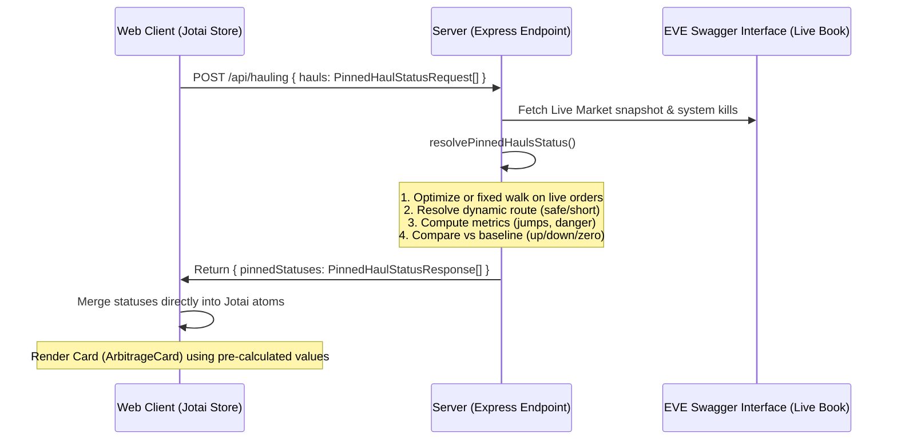

# Pinning Functionality & Architecture

The pinning functionality allows players to save and track profitable arbitrage hauls across three stages of their delivery lifecycle. It re-evaluates routes, pricing depth, and expected profit in real-time as market conditions change.

## 1. Lifecycle Stages

1. **Planning Stage**: 
   - Player needs to purchase items at the source.
   - Pinned cards are dynamically re-optimized to the max-income quantity that fits the player's current cargo capacity (`capacity` m³) and wallet balance (`balance` ISK).
   - Expected profit is recalculated continuously.
   - The route display shows the complete journey: `Current System → Pickup Station → Dropoff Station`.
   - Re-optimization prevents quantity selection from dropping below profitability (income <= 0). If the deal becomes unprofitable, quantity drops to 0, which flags the card as zero-income.

2. **Transferring (Transit) Stage**:
   - Player has purchased a specific quantity at a specific price, and the items are now loaded into their ship.
   - The purchased quantity and purchase price are locked (fixed).
   - Expected profit is recalculated dynamically against live destination buy orders using the fixed purchase price and quantity. Profit can become negative if destination demand drops.
   - The route display updates to show: `Current System → Dropoff Station` (omitting the pickup leg since the items are already in the ship).
   - In this stage, players can also view alternative liquidation markets and redirect the haul, establishing a new baseline.

3. **Done Stage**:
   - Items were successfully delivered and sold in the game. Card is marked as executed.

---

## 2. Architecture & Data Flow

Our architecture follows a thin-client, thick-server design to prevent client-side synchronization and calculation bugs:

### Front-End (Jotai Store & UI)
- **Local Storage State**: The front-end holds the collection of pinned items in `pinnedHaulsAtom` via local storage. It only maintains the structural metadata (`id`, `typeId`, endpoints, stage status) and baseline values (`originalProfit`, confirmed `boughtQuantity`, confirmed `boughtPrice`).
- **Reactive Refresh Trigger**: User mutations (pinning, unpinning, confirming buy, redirecting) increment a `haulingRefreshTriggerAtom`. The controller hook (`useHaulingSearchController`) listens to this trigger and immediately runs a silent background refresh to update card data instantly.
- **Dumb Rendering**: The `ArbitrageCard` component performs no custom route mapping, visual comparison arithmetic, or coloring logic. It reads pre-calculated properties (`borderColor`, `statusKind`, `statusMessage`, and routes/jumps) from the synced Jotai store and renders them directly.

### Back-End (Server Services)
- **Status Resolver (`resolvePinnedHaulsStatus`)**: Re-prices pinned items against the live order book snapshot. Each pinned haul evaluates the order book **independently** — pins do not consume each other's orders, so the same item pinned to different destinations is evaluated on its own merits.
- **Dynamic Routing**: Resolves the exact system-to-system jump paths and danger camps using the player's active position (`origin`) and chosen routing settings (`safest` vs `shortest`).
- **Baseline Comparison**: Compares the live expected profit against the baseline (`originalProfit`). It outputs visual metadata (`borderColor` and `statusMessage`) indicating if profit is up (green), down (orange), or collapsed to zero/negative (red).

---

## 3. Comparison with Original Solution

We refactored the pinning system to solve reliability issues, client-server desyncs, and complex UI logic:

| Feature / Aspect | Original Solution | Refactored Solution (Current) |
| :--- | :--- | :--- |
| **Calculation Location** | FE calculated indicators, routes, jumps, and compared live profit vs baseline. | Server performs all route resolutions, metrics, baseline comparisons, and formatting. |
| **Route Sync** | FE fetched routes asynchronously via separate `/api/route` queries for transit cards, while planning card routes stayed stale. | Server calculates exact routes dynamically for all cards during the combined `/api/hauling` call. |
| **UI Jitter & Desyncs** | Newly pinned or updated cards displayed stale/default states for up to 10s until the periodic poll completed. | Jotai refresh trigger forces an immediate silent background check, updating cards instantly. |
| **Transit Card Profit** | Transit cards failed to sync live profits, showing only stale original estimations. | Transit cards correctly display live expected profits based on destination bids and fixed buy costs. |
| **Card Border Colors** | FE computed border colors from raw values, leading to mismatches (e.g. blue borders when profit collapsed). | Server returns the authoritative color class (`success.main`, `error.main`, etc.) which the FE renders directly. |
| **State Complexity** | FE tracked advisory properties (`liveProfit`, `liveQuantity`, etc.) separately from display values. | FE merges all server-computed display values directly onto the card model, eliminating duplicate properties. |

---

## 4. Key Implementation Notes

- **Jitter Prevention**: The back-end compares live income against the baseline with a ±3% threshold band (`PROFIT_BAND = 0.03`). Jitter within this band does not trigger arrow direction changes, preventing UI flicker.
- **Planning Zero-Income Display**: The re-optimization walk in the planning stage stops as soon as the marginal unit profit becomes negative, so quantity drops to 0 and profit resolves to 0. The card displays `0 M ISK` — there is genuinely no opportunity, and the player can simply unpin the item. The status message reads: *"Income dropped to zero: … You can still confirm the buy/price you actually paid."*
- **Negative Transit Profit**: Transit cards do not abort at negative profit boundaries because the items are already in the ship. The algorithm walks the live destination bids against the fixed purchase cost and resolves the actual profit, which can be negative (e.g. `-12.2 M ISK`). The card displays this value directly so the player sees the real loss and can decide to sell at the current destination or redirect to an alternative market. The status message reads: *"Income is negative: … You can sell at a loss or find an alternative destination."*
- **No Client-Side Income Override**: The front-end renders the server-computed `profit` value as-is (`formatIskMillions(dispProfit)`) and colors it red when `profit <= 0`. There is no client-side capping or zero-substitution — the algorithm is the single source of truth for both stages.
- **Independent Order Evaluation**: Each pinned haul evaluates the full order book independently — there is no shared "remaining volume" ledger across pins. This means pinning item X from A→B and item X from A→C will both see the full order depth at station A and be evaluated on their own merits. The rationale: pinned hauls are independent planning scenarios (e.g. comparing destinations), not a committed multi-buy shopping list. A previous design netted shared order depth across pins, but this caused confusing behavior where the second pin would immediately show red simply because the first pin had already "claimed" all source orders.